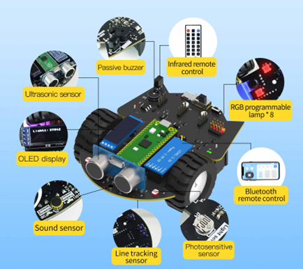
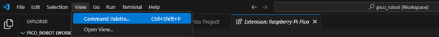
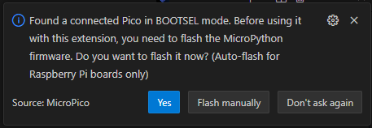
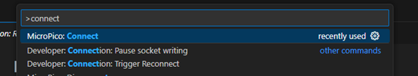
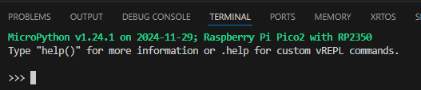
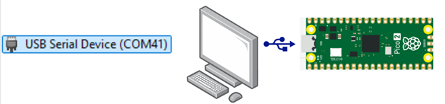
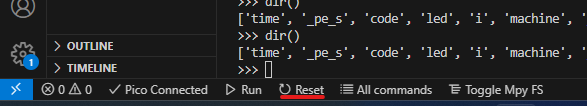

Pico Robot megismerése és digitális I/O kezelése
================================================

Bevezetés
------------

A laboratóriumi gyakorlat célja, hogy a hallgatók megismerjék a Raspberry Pi Pico Robot eszközt, a MicroPython programozási nyelvet, és a Visual Studio Code fejlesztőkörnyezetet. A gyakorlati feladatokon keresztül betekintést nyernek a hardver közeli programozás alapjaiba.
Továbbá a digitális be- és kimenetek kezelésének megismerése. Egyszerű és sorosan felfűzhető „programozható” LED-ek kezelése. PWM jelgenerálás, LED-ek PWM meghajtása. Digitális bemenetek kezelésének elsajátítása.
	
### A labor végeztével a következő ismereteket sajátítja el:

* Raspberry PI Pico mikrokontroller és fejlesztőkártya általános ismerete
* Pico Robot hardvare beüzemelése
* Vscode fejlesztőkörnyezet használata
* MicroPython programozás alapvető szintaxisának ismerete
* Pico robot programozása, alaphelyzetbe állítása
* Alapvető Ki/Bemenetek konfigurálása és használata

### Előkövetelmények:

Ez a labor mérés bevezető mérés. 
Programozás I/II.
A következő eszközök szükségesek a labor méréshez:
* Számítógép, Windows vagy Linux Operációs Rendszerrel (MAC OSX nem tesztelt)
* Vscode fejlesztőkörnyezet - https://code.visualstudio.com/
* VScode Raspberry Pi Pico extension - https://marketplace.visualstudio.com/items?itemName=raspberry-pi.raspberry-pi-pico
* VScode Serial monitor extension https://marketplace.visualstudio.com/items?itemName=ms-vscode.vscode-serial-monitor 
* Pico Robot - http://www.yahboom.net/study/Pico_Robot 

Konvenciók:


>**Információ**	
Háttérinformáció az adott feladathoz ami segíti az anyag megértését.


>**!Figyelem!**
Fontos információ, ellenőrizendő vagy végrehajtandó lépés ami nélkül a mérés/feladat sikertelen lehet.

 
Elméleti összefoglaló
=====================

Pico Robot
----------

A Pico Robot jelenleg két választható fő vezérlővel rendelkezik: Pico és Pico 2. A labor során a Pico 2 vezérlőt használjuk. A robot ultrahangos (Ultrasonic sensor) és fényszenzorokkal (Photosensitive sensor, photoresistor), OLED kijelzővel (display), infravörös vevőkkel (Infrared remote control), zümmer/Sípolóval (Buzzer), Mikrofonnal, Bluetooth modullal, Vonalkövető szenzorral (Line tracking) és RGB LED - ekkel rendelkezik, így képes akadályelkerülésre, távirányításra és más funkciók ellátására.


 
A központi vezérlő egység a Raspberry Pi Pico 2 mikrokontroller-fejlesztői lap (Az ábrán középen zöld nyáklap), amelyet a Raspberry Pi tervezett több digitális és analóg perifériával. Az RP2350 mikrokontroller chipet használja, amely kettős ARM Cortex M33 vagy Hazard3 (RISC-V) processzorral rendelkezik, akár 150 MHz-es órajellel, 520 KB SRAM-mal és 4 MB memóriával.


>**Intormáció:**
Az RP2350 adatlapja elérhető amiben részletes ismertetés van a CPU és perifériákról: https://datasheets.raspberrypi.com/rp2350/rp2350-datasheet.pdf 
Intormáció	További részletesebb információ a gyártó oldaláról érhető el: http://www.yahboom.net/study/Pico_Robot 

Beágyazott rendszerek és a MicroPython rövid bemutatása
-------------------------------------------------------

### Beágyazott rendszerek: 

Olyan rendszerek, amelyek hardver- és szoftverelemei szorosan együttműködnek, meghatározott funkciók ellátására. Példa: robotok, szenzorhálózatok.

### MicroPython: 

A MicroPython egy egyszerűen használható futtatókörnyezet, amely lehetővé teszi, hogy elektronikai eszközöket, például mikrokontrollereket programozzunk.

Ez egy interpretáló futtatókörnyezet, ami azt jelenti, hogy a program utasításait közvetlenül, lépésenként hajtja végre, ahelyett, hogy előre lefordítaná a gép számára érthető formára. Ez megkönnyíti a programírást és a hibakeresést, mert azonnal látjuk az eredményt.

Hátrányai a fordított nyelvekhez (pl. C) képest:
* Lassabb futásidő – Mivel a programot futás közben értelmezi, lassabb lehet, mint egy előre lefordított nyelv, például a C.
* Nagyobb memóriaigény – Az értelmező (interpreter) önmagában is foglal memóriát, így kevesebb hely marad az eszköz egyéb feladataira.
* Kevesebb hardverközeli vezérlés – A C nyelvvel közvetlenebbül és hatékonyabban lehet kezelni az eszköz erőforrásait, például a memóriát vagy a processzort.

Ennek ellenére a MicroPython előnye, hogy könnyen tanulható és gyors fejlesztést tesz lehetővé, így kiváló választás egyszerűbb elektronikai projektekhez.

VScode alapok:
--------------

A Beágyazott rendszerek laborokon a Visual Studio Code (VSCode) program van a telepítve a labor gépekre a feladatok megoldásának segítésére. A VScode egy ingyenes, nyílt forráskódú kódszerkesztő, amelyet széles körben használnak szoftverfejlesztésben és programozásban. Könnyű használata, bővíthetősége és hatékonysága miatt ideális választás egyetemi projektekhez és laborfeladatokhoz.

### Alapvető funkciók

1.	Több programozási nyelv támogatása

    A VSCode támogatja a legnépszerűbb programozási nyelveket (pl. Python, C/C++, Java, JavaScript stb.), és kiegészítőkkel (extension) bármilyen nyelvhez testreszabható.

2.	Intelligens kódkiegészítés (IntelliSense)
    
    A szerkesztő automatikusan javaslatokat tesz a kód írása közben, ami gyorsabb és hibamentes munkát tesz lehetővé.

3.	Integrált terminál
    
    Beépített terminállal rendelkezik, így nem kell váltani a kód és a parancssor között. A terminál megnyitható a `Ctrl + `` billentyűkombinációval.

4.	Verziókezelés (Git integráció)
    
    Beépített támogatást nyújt a Git verziókezelőhöz, ami lehetővé teszi a kód változtatásainak nyomon követését és a csapatmunka egyszerűsítését.

5.	Bővíthetőség (Extensions)
    
    A Extensions Marketplace-en keresztül számtalan kiegészítő telepíthető, például nyelvi támogatás, formázó eszközök vagy hibakereső eszközök.
    Raspberry Pi Pico bővítmény előre van telepítve. Ez biztosítja az egyszerű feladatok végrehajtását a Rapsberry Pocoval, mint például soros port csatlakozása, firmware frissítés vagy script file-ok letöltése és futtatása.

Az egyik legfontosabb funkció a parancsok futtatása „Ctrl + Shift + P” billentyűkombinációkkal érhető el:



>**!Figyelem!** 
Az egyik legfontosabb funkció a parancsok futtatása „Ctrl + Shift + P” billentyűkombinációval érhető el.

 
 
Gyakorlat: Firmware frissítés
=============================

Mi az a firmware?
-----------------

A firmware olyan alacsony szintű, a hardver és a szoftver közötti köztes rétegként működő szoftver, amely közvetlenül a hardver eszközök működését vezérli. A firmware-t tipikusan a hardver beágyazott memóriájába (pl. flash memória) töltik, és a hardver eszköz alapvető funkcióinak működtetéséért felelős. Jelen esetben a MicroPython Firmware-t használunk a Pico-n. Ez biztosítja azokat az alapszintű funkciókat, amelyekkel a fejlesztő Python kódot futtathat. Továbbá lehetővé teszi a GPIO-tüskék, a szenzorok és más hardverkomponensek vezérlését Python utasításokkal.

A Raspberry Pi Pico mikrokontroller firmware-frissítése több esetben is szükségessé válhat:

1.	Kezdeti beállítás: 

    A Pico alapértelmezetten nem tartalmaz előre telepített firmware-t, így MicroPython kódok futtatásához mindenképp telepíteni kell a megfelelő firmware-t.

2.	Hibaelhárítás: 

    Ha a mikrokontroller hibás állapotba kerül (pl. hibás kódot töltöttünk fel), a firmware újratelepítésével „gyári” állapotba állítható vissza.

3.	Funkcióbővítés: 

    Új firmware verziók használatával fejlesztett funkciók érhetők el.

### A Pico 2 és a UF2 bootloader

A Pico 2 mikrokontroller UF2 bootloader-rel rendelkezik, amely leegyszerűsíti a flashmemória programozását. Ennek köszönhetően nincs szükség külső programozó hardverre.

>**Intormáció:**
További informácók a bootloaderekről: https://makecode.com/blog/one-chip-to-flash-them-all 

 
Firmware frissítés menete:
--------------------------

### Bootloader indítása:

Bootloader módba helyezéséhez a firmware frissítéshez két lehetőség van:

1.	tartsa nyomva a BOOTSEL gombot, miközben USB-vel csatlakoztatja a PICO fejlesztőkártyát.

VAGY

2.	Futtassa a machine.bootloader() parancsot a MicroPython REPL felületen. (Később részletezve)

### Firmware letöltése

#### Manuális:

A bootloader módba kapcsolt PICO csatlakoztatása után a megjelenő USB-tárolóeszközre másolja át az .uf2 kiterjesztásű fájlt. (Labor anyagban elérhető) Miután az új firmware programozása befejeződött, az eszköz automatikusan újraindul, és készen áll a használatra.

>**Intormáció:**
A legfrissebb microPython firmware elérhetősége: https://micropython.org/download/RPI_PICO2/ 

#### VScode:

A VScode program is képes a firmware letöltésére. Nem szükséges manuálisan fájlt másolni. Ha a VScode el van indítva a számítógépen akkor automatikusan észleli a bootloader módba csatlakoztatott eszközt és felajánlja a microPython firmware frissítésést, csak a „Yes” gombra kattintva automatikusan letöltődik a legfrissebb firmware.
 

 
### Raspberry PICO firmware ellenőrzése

Mielőtt a bármelyik labor feladatokat elkezdené megoldani, érdemes ellenőrizni a Pico HW állapotát és az alapvető funkciókat. 
A rendszer ellenőrzéshez csatlakozni szükséges a Pico interaktív parancssorhoz.

1.	Csatlakoztassa a Pico-t a számítógéphez. (Micro USB port)
2.	A VScode elindítása.
3.	Raspberry Pico extension aktiválása:
    1. Aktiválja a „Command Palette” felületet. „Ctrl + Shift + P”
    2. Válassza a MicroPico: Connect parancsot



Futtatás után a MicroPico vREPL terminal automatikusan aktiválódnia kell:



Ha a terminal nem nyílik meg akkor érdemes a firmware-t újratelepíteni: “Firmware frissítés menete:” fejezet szerint.

 
A MicroPython REPL
==================

A MicroPython REPL egy interaktív felület, amely lehetővé teszi, hogy közvetlenül kommunikáljon a MicroPython-t futtató eszközzel (pl. Raspberry Pi Pico, ESP32 stb.). A REPL a Read-Eval-Print Loop rövidítése, ami magyarul azt jelenti, hogy Olvas-Értékel-Kiír-Ciklus. Ez egy olyan környezet, ahol a felhasználó beírhat Python parancsokat, amelyeket a rendszer azonnal végrehajt, és az eredményt azonnal visszaadja.

### Hogyan működik a REPL?

1.	**Olvas (Read):** A REPL várja a felhasználó bemenetét (pl. egy Python parancsot vagy kifejezést).
2.	**Értékel (Eval):** A MicroPython értelmezi és végrehajtja a beírt kódot.
3.	**Kiír (Print):** Az eredményt (vagy hibát, ha van) kiírja a képernyőre.
4.	**Ciklus (Loop):** A folyamat ismétlődik, amíg a felhasználó nem lép ki a REPL-ből.

### Csatlakozás a REPL-hez

A MictoPython parancsértelmező a célharveren vagyis a Pico miktrokontrolleren működik és hajtja végre a parancsokat. USB-vel csatlakozik a számítógéphez és egy virtuális sorosporton keresztül (USB Serial Device vagy USB CDC) fogadja és küldi az adatokat.


 
Bármilyen sorosportot támogató terminállal lehet csatlakozni a MicropPython parancsértelmezőhöz. Például: PUTTY, Tera Term. Hterm, minicom, picocom stb. De ahogy fentebb látható a VScode tartalmaz beépített terminált.

>**Intormáció**
A csatlakozás menete VScode nélkül:
1. A COM port sorszám megkeresése eszközkezelőben. (Windows esetén)
	1. Jobb klikk start menü-re utána device manager/eszközkezelő kiválasztása, Portok alcsoport alatt az USB Serial Device feljegyzése
2. A megfelelő programban (PUTTY, Tera Term stb.) válassza a beállításnál a megfelelő port számot, illetve a baud rate beállításokat: Speed: 115200 Data bits: 8, Stop bits: 1, Parity: None, Flow Control: None
https://docs.micropython.org/en/v1.9.3/wipy/wipy/tutorial/repl.html#windows 


 
### REPL funkciók:

Miután csatlakozott, a >>> prompt jelzi, hogy készen áll a parancsok fogadására illetve beírására.
Próbálja ki a következő egyszerű parancssorozatot:

```py
#REPL
>>> print("Hello, World!")
Hello, World!
>>> 2 + 3
5
```

Hasznos funkciók a REPL-ben

* **Kód tesztelése:** Gyorsan kipróbálhat kódrészleteket anélkül, hogy teljes programot írna.
* **Hibakeresés:** Azonnal látható a hiba, és gyorsan lehet kijavítani a kódot.
* **Hardver kezelése:** Közvetlenül vezérelhető a mikrovezérlőhöz csatlakoztatott érzékelők, LED-ek vagy más perifériák.
Például:

 
### A PICO és a REPL újraindítása

A VScode MicroPico kiegészítő modul beépített funkciót tartalmaz az újraindításra. Az alábbi képen látható a funkció:


 
A ```machine.reset()``` utasítással lehet ugyan ezt a funkciót elérni, ami újraindítja a micropython futtató környezetet. Ha ez nem működik, mert például egy végtelen ciklusba kerult a vegrehajtas akkor a ```Ctrl + C```-t használja, ami megszakítja az aktuális kód futását.

Mivel a REPL az alapértelmezett python program ami bootolás után elindul, ezért Soft vagy Hard reset után egy új, friss REPL környezet indul el. Az előzőleg létrehozott változók törlődnek a memóriából. Később az alapértelmezett REPL programot felül lehet írni más egyéni programmal. A fájlrendszer résznél majd bővebb információt talál erről.
Figyelem 	CTRL + C: Program végrehajtás megszakítása. Nem másoló funkció! Szöveg beillesztést és másolást jobb egérgombbal lehet elvégezni.

Tesztelje a következőt:
Hozzon létre néhány változót és listázza a dir() paranccsal:
Adja ki a machine.soft_reset() vagy machine.reset() parancsot vagy nyomja meg Ctrl + D kombinációt. (A parancs is újraindítja a REPL felületet mint a billentyűkombináció.)
Futassa ismét a dir() parancsot. Mit figyelt meg?
 
Automatikus behúzás¶
Amikor Python utasításokat írunk, amelyek kettősponttal végződnek (például if, for, while), akkor a prompt három pontra (…) változik, és a kurzor 4 szóközzel beljebb kerül. Amikor lenyomjuk az Enter billentyűt, a következő sor ugyanazon a behúzási szinten folytatódik a szabályos utasítások esetén, vagy további behúzási szintre kerül, ha szükséges. Ha a Backspace billentyűt nyomjuk meg, akkor egy behúzási szintet visszavon.
Ha a kurzor teljesen visszakerül a sor elejére, akkor az Enter billentyű lenyomására a begépelt kód végrehajtásra kerül. Az alábbiakban látható, hogy mit tapasztalunk egy for utasítás begépelése után (az aláhúzás jelzi, hogy hová kerül a kurzor).
Ezek alapján qrja be és futtassa az alábbi kódot:
Automatikus behúzás nem kerül alkalmazásra, ha az előző két sor csak szóközöket tartalmazott. Ez azt jelenti, hogy egy összetett utasítás befejezéséhez kétszer kell lenyomni az Enter billentyűt, majd a harmadik lenyomásával az utasítás befejeződik és végrehajtásra kerül.

Automatikus kiegészítés¶
Amikor parancsot ír a REPL-ben, és az eddig beírt sor valaminek a nevének elejére illeszkedik, akkor a TAB billentyű lenyomásával megjeleníthetők a lehetséges beírható opciók. Például először importálja a machine modult az import machine beírásával és az Enter megnyomásával. Ezután írja be az m betűt, majd nyomja meg a TAB billentyűt, és ez a machine-re kell, hogy bővüljön. Írjon be egy pontot (.), majd nyomja meg újra a TAB billentyűt. Valami ehhez hasonlót lehet látni:
 
Másoló/Beillesztő mód (Paste mode)¶
Figyelem 	Az alábbi billentyűkombinációk a VScode környezetben alapértelmezetten más funkciókhoz vannak rendelve. Ahhoz, hogy a beillesztő módot aktiválni lehessen, ki kell kapcsolni az alapértelmezett funkciót. Keresse meg a „Preferences: Open Keyboard Shortcuts” és törölje az összes CTR+E és CTRL+D kombinációt a listából.
Ha kódot szeretne beilleszteni a REPL terminál ablakba, az automatikus behúzás funkció összezavarhatja a dolgokat. A Ctrl-E billentyűkombinációval, átvált a REPL a beillesztési módba, amely lényegében kikapcsolja az automatikus behúzást, és a promptot “>>>”-ról “===”-re változtatja.
A Beillesztési mód lehetővé teszi üres sorok beillesztését is. A beillesztett szöveget úgy fordítja le a rendszer, mintha egy fájl lenne. A Ctrl-D billentyűkombináció lenyomásával kiléphet a beillesztési módból, és elindítható a fordítás.
Próbálja az alábbi kódot bemásolni a sima auto behúzás módba és a beillesztési módba is:

A speciális “_” (aláhúzás) változó
Amikor a REPL-t használja, számításokat végezhet és megtekintheti az eredményeket. A MicroPython az előző utasítás eredményét az “_” (aláhúzás) változóban tárolja. Így az aláhúzás segítségével elmenthető az eredmény egy változóba. Például:

 
Indítási sorrend (Boot Sequence)
Amikor a MicroPython hard vagy soft reset után újraindul, a következő indítási sorrendet követi:
1.	_boot.py
Ez egy belső szkript, amely a MicroPython firmware-be van előre kódolva. Számos porton a MicroPython biztosítja, hogy elvégezze a létfontosságú inicializálást.
Például a legtöbb porton a _boot.py észleli, ha egy új eszköz első indítása történik, és formázza a belső flash fájlrendszert, hogy használatra kész legyen. A Pico eszköznél is így van és ha már talál meglévő fájlrendszert, akkor azt használatba veszi. Tehát firmware frissítés vagy újra telepítés esetén is megmaradnak a már letöltött szkript fájlok.
Hacsak nem egyéni MicroPython buildet készül vagy új port létrehozása a cél, nem kell folalkozni a _boot.py miatt. Nem érdemes változtatni a tartalmán, cask ha tényleg tudja az ember mit csinál. (Egyébként nem is lehet micropython fordítás nélkül)
2.	boot.py
Egy boot.py nevű fájl másolható az eszköz belső fájlrendszerébe.
Ha a boot.py fájl megtalálható, akkor az végrehajtásra kerül. Ebben a fájlban adható hozzá inicializáló kód, amely egyedi, egyszeri inicializálást végez (például az eszköz hardverének konfigurálását).
Gyakori gyakorlat, hogy a boot.py-ban konfigurálják az eszköz hálózati kapcsolatát, így az mindig elérhető lesz újraindítás után a REPL használatához.
Figyelem 	A boot.py-nak mindig ki kell lépnie, és nem futhat végtelen ciklusban.
Megjegyzés:
Néha egyszerűbb, ha nincs boot.py fájl, és az inicializáló kódot a main.py tetejére helyezzük.
Intormáció	Néha egyszerűbb, ha nincs boot.py fájl, és az inicializáló kódot a main.py tetejére helyezzük. Viszont ha sokszor használja a REPL-t és ne makar mindig manuálisan konfigurálni például pineket akkor érdemes a boot.py-t használni.

3.	main.py
Hasonlóan a boot.py-hoz, egy main.py nevű fájl másolható az eszköz belső fájlrendszerébe. Ha megtalálható, akkor a következő lépésben végrehajtásra kerül a boot.py után.
A main.py azon Python kódok számára szolgál, amelyeket minden indításkor futtatni szeretne.
Néhány tipp a main.py használatához:
•	A main.py-nak nem kell kilépnie, nyugodtan lehet benne egy végtelen while True ciklus.
•	Összetett Python alkalmazások esetén nem kell az összes kódot a main.py-ba tenni. A main.py lehet egy egyszerű belépési pont, amely importálja az alkalmazást és elindítja a végrehajtást:

Interaktív értelmező (REPL)
Ha a main.py nem található, vagy ha a main.py kilép, akkor a MicroPython interaktív értelmező módja (REPL) azonnal elindul.
Intormáció	Még ha a main.py tartalmaz is egy végtelen ciklust, a REPL soros porton beírt Ctrl-C egy “KeyboardInterrupt”-ot injektál. Ha nincs kivételkezelő, amely elkapja, a main.py kilép, és a REPL elindul. A boot.py és main.py-ban beállított globális változók továbbra is elérhetők lesznek a REPL globális kontextusában.

Indítási hiba (Téglásítás/Bricking)
Előfordulhat fejlesztés közben, hogy a MicroPython elérhetetlenné válik az indítás során, amelyet néha "bricked"-nek (téglásításnak) neveznek. Például:
•	Ha a boot.py végrehajtása elakad, és a natív USB soros port soha nem inicializálódik.
•	Ha a Python kód újrakonfigurálja a REPL interfészt, így az hozzáférhetetlenné válik.
A helyreállítás lehetséges. A legegyszerűbb az útmuató elején leírt Firmware frissítés elvégezni. Illetve szükséges lehet még a virtuális fájlrendszer törlése a „Fájlok listázása és törlése:” fejezet szerint.
 
Fájlok kezelése micropython-nal:
A MicroPython egy Unix-szerű virtuális fájlrendszer réteget (Virtual File System, VFS) valósít meg. Az összes csatolt fájlrendszer egyetlen virtuális fájlrendszerbe kerül összevonásra, amely a gyökérkönyvtárból (/) indul. A fájlrendszerek ebbe a struktúrába kerülnek csatolásra könyvtárakba, és az indításkor a munkakönyvtár átvált arra a helyre, ahol az elsődleges fájlrendszer csatolva van. Ez jelen esetben a “/”.
Ahogy az indítási szekvenciánál is látható fájlokat lehet feltölteni a micropython virtuális fájlrendszerébe. Ezeket a fájlokat illetve szkripteket lehet felhasználni és a projektstruktúrát javítani illetve átláthatóbbá tenni.
Gyakorolja a fájlok kezelését és használatát:
VScode-ban hozzon létre két új fájlt a következő tartalommal:
module2.py
Töltse le a két fájlt a Pico 2 fejlesztőkártyára: CTRL+SHIFT+P és keressen az Upload file to Pico parancsra. Figyeljen, hogy az aktuálisan megnyitott/aktív fájl fog feltöltődni.
 
Ezután REPL-ben próbálja ki a következő utasításokat:
Ahogy látható a fájl neve az maga a micropython modul amit importálni kell.
Hozzon létre egy main.py fájlt a következőkóddal:
Még ne töltse le a Pico eszközre a fájlt, csak futtassa a létrehozott main.py fájlt a „Run current file on Pico” paranccsal.
 
Vagy használja a Run gyorsgombot a VScode ablak alján:
 
Állítsa le a main.py program végrehajtását CTRL+C billentyűkombinációval.
Most töltse le a main.py fájlt a Pico eszközre. Utána indítsa újra a pico eszközt a megtanult machine.reset() módszerrel. (Fizikai áramtalanítás, USB lecsatlakoztatása is RESET megoldás lehet.)
Mit tapasztal? Elindult automatikusan a main.py script?
A VScode folyamatosan figyeli az új eszköz csatlakoztatását és amint talál egyet megpróbál a REPL-hez csatlakozni. Emiatt a main.py script végrehajtása azonnal leáll. (Talán még annyi végrehajtás idő van, hogy a LED bekapcsol.)
Az automatikus csatlakozás a VScode-ban letiltható. (Vagy más megoldásként a VScode-ot be lehet zárni.) A beállítások között „FilePreferencesSettings” menüpontban keressee meg a Micropico Auto Connect opciót. A jelölő négyzettel deaktiválható az automatikus csatlakozás:
 
Most próbálja újra csatlakoztatni a PICO eszközt a számítógéphez vagy adja ki a machine.reset() utasítást. 
A REPL terminál nem használható mert nem interaktív terminálként funkciónál most a virtuális soros port. Ezért a soros port monitor ebben az esetben hasznosabb. Használja a VScode-ba épített soros port monitor kiegészítő modult az alábbi beállításokkal:
 
Itt már megjelenik a „LED is toggled” szöveg.
Állítsa le a soros port monitorozást és csatlakozzon újra a PICO REPL-hez. Használhatja a Connect parancsot:
 
Vagy a gyorsgombot az ablak alján:
 
 
Fájlok listázása és törlése:
Próbálja ki a következő utasításokat, ami a Pico eszköz virtuális fájlrendszerén listázza az elérhető fájlokat:

Látszik, hogy több fájl van a virtuális fájlrendszeren. A laborok során sok próba fájl kerül a rendszerre. A firmware újratelepítése nem törli a fájlrendszert. Ha a _boot.py indítási szkript talál meglévő fájlrendszert, akkor azt újra használatba veszi. Emiatt szükséges lehet manuálisan törölni a fájlokat. Például egy hibásan megírt main.py ugyan úgy a virtuális filerendszerben marad egy firmware frissítés esetén!
Egy fájlt az alábbi utasítással lehet törölni:
Lehetséges, hogy érdemes az összes fájlt törölni egyszerre ha túl sok fájl gyűlt össze. Ebben az esetben formázni is lehet a virtuális fájlrendszert.
Így a rendszer teljesen alaphelyzetbe került.
 
Kérdések önellenőrzéshez
Mi az a REPL?
Hogyan történik a micropython rendszerbetöltési folyamat?
Mi az a firmware?
Miért szükséges az automatikus behúzás funkció?
Kutatási feladatok
Hozzon létre mappákat a virtuális fájlrendszeren. Helyezzen el .py modul fájlokat az almappákba és próbálja meg importálni.

(Bónusz) Csináljon „dead loop” programot: hozzon létre egy main.py fájlt végtelenített while ciklussal és „sys.stdin.read(1)” olvasással blokkolja a soros portot. Próbálja utána leállítani és helyreállítani a Pico eszközt.

 
Digitális be- és kimenetek kezelése

Elméleti összefoglaló, segítség a felkészüléshez
Digitális be- és kimenetek
A mikrovezérlők alapvető perifériái a digitális I/O portok. (Gyakori elnevezés a GPIO – General Purpose Input/Output.) A digitális portok általános esetben háromállapotúak, ami azt jelenti, hogy egy bitnél:
-	kimenetként az adott kivezetés felveheti a logikai 0 vagy 1 állapotot;
-	bemenetként a kimeneti meghajtók nagyimpedanciás (Hi-Z) állapotban vannak.
Természetesen vannak olyan GPIO lábak, amelyek nem használhatóak mindhárom állapotban, pl. csak bemenetek lehetnek.
Mivel a mikrovezérlők kivezetésszáma korlátozott, és a beépített perifériák a rendelkezésre álló kivezetéseknél több lábat igényelnének, ezért egy-egy GPIO kivezetéshez több alternatív funkció is tartozhat, pl. egy A/D csatorna vagy egy kommunikációs interfész egy jele használhatja még fizikailag ugyanazt a kivezetést, mint az alapfunkció (digitális I/O). Az alábbi ábrarészlet a Raspberry Pi Pico adatlapjából származik, amely jól mutatja az alternatív funkciókat.
 
1. ábra – Példa a Raspberry Pi Pico többfunkciós kivezetéseire
A 32-es kivezetés azon kívül, hogy a GP27-es digitális I/O láb fizikai kapcsolatának megvalósítására szolgál, átkapcsolható A/D bemenetre (ADC1), illetve lehet az egyik I2C kommunikációs busz órajele is (I2C1 SCL). A funkciók közötti átkapcsolást a programból végezzük el. Az alkalmazott függvények magas szintűek, a hardvert „elrejtik”, de valójában a mikrovezérlő regisztereiben állítják át a megfelelő biteket.
A digitális bemenetek a CMOS technológiánál „lebegnek”, határozatlan logikai szinten vannak. Ennek elkerülése érdekében lehetőség van lehúzó (pull-down) illetve felhúzó (pull-up) ellenállásokat bekapcsolni, amelyek határozott logikai szintet tartanak a bementen akkor, ha nem vezéreljük azokat. Ugyanakkor ezek az ellenállások nagy értékűek, tehát a külső vezérlést nem akadályozzák.
A digitális kimenetek alapvetően digitális bemenetek vezérlésére vannak megalkotva, de a mai mikrovezérlőknél ezek a kimenetek viszonylag nagy terhelést is elviselnek. Az alábbi ábra a RaspBerry Pi Picon található LED-nek közvetlenül a portlábról való meghajtását láthatjuk. Figyeljük meg, hogy a LED nem közvetlenül a portlábra csatlakozik, az áramkorlátozó ellenállás állítja be a LED áramát!
 
2. ábra – LED a GPIO25-ös portlábon
A digitális bemenetre nyomógombot legegyszerűbben úgy helyezhetünk el, ha bekapcsoljuk a fel- vagy lehúzást, és a bemenet és a föld vagy tápfeszültség közé kötjük a nyomógombot. (Pl. felhúzás esetén meg nyitott kontaktus esetén logikai 1, zárt kontaktus esetén logikai 0 lesz a digitális bemenet állapota.)
A konfigurálható LED-ek kezelése
A robotban 8 darab konfigurálható LED található. Ezekről részletesen előadáson volt szó, itt csak egy rövid összefoglalót közlünk. A robotban elhelyezett konfigurálható LED-ek 3 különböző színű LED-et tartalmaznak (R – vörös, G – zöld, B – kék). Mindhárom LED fényességét 256 lépcsőben állíthatjuk, így 16 millió árnyalat állítható elő. A LED tehát komponensenként 8, összesen 24 bittel konfigurálható.
A robotban található LED típusa WS2812. A LED 4 kivezetéses: tápfeszültséget igényel (VDD, GND), és van egy digitális bemenete (DI) és egy digitális kimenete (DO). A LED nem igényel előtét ellenállást, a LED-be áramgenerátorok vannak integrálva. A WS2812 LED katalógusból származó bekötését az alábbi ábra mutatja.
  
3. ábra – A WS2812 LED bekötése
A LED digitális kimenete szolgálhat egy, a láncban következő LED digitális bemenetéül, tehát a LED-ek láncba köthetőek, ahogy az alábbi (szintén a katalógusból származó) ábrák mutatják.
 
4. ábra – A WS2812 LED-ek kaszkádba kötése (katalógus ábra)
 
5. ábra – A WS2812 LED-ek kaszkádba kötése (a robot kapcsolási rajz részlete)
Mivel a bitminta kiküldését az alkalmazott függvények elfedik, itt csak annyit közlünk tájékoztatásul, hogy egy LED 24 bites konfiguráló szava hogyan néz ki. Amint az az alábbi ábrán látszik, a komponensek sorrendje zöld-vörös-kék, ezen belül a legmagasabb helyiértéktől (MSB) kell kezdeni a minta kiküldését.
 
6. ábra – A WS2812 konfiguráló szava
A PWM jel
A PWM jelentése: impulzus-szélesség moduláció. A jel digitális, ha a jel periódusideje állandó, az információt az egy perióduson belüli kitöltés (magas szint) ideje hordozza. A mikrokontrollereknél mind a PWM jel frekvenciája, mind a kitöltése változtatható, de a legtöbb esetben csak a jel kitöltését változtatjuk. A kitöltés 0…100% tartományban változtatható. 0%-os kitöltés esetén a PWM jel mindig 0, 100%-os kitöltés esetén pedig mindig 1 logikai szintű. Ha a kitöltés 50%, akkor szimmetrikus négyszögjel a kimeneti jel. Néhány kitöltéshez az alábbi ábra szemlélteti a kimeneti jelalakot.
 
7. ábra – PWM jel néhány kitöltési tényező esetén
Az, hogy a 0…100% közötti kitöltést milyen felbontással képes a mikrovezérlő változtatni, meghatározza a lépésközt. Pl. 7 bites felbontás esetén 128 különböző kitöltés állítható be 0…100% között, azaz a lépésköz kisebb, mint 1% (0,78%).
A PWM jel számos célra felhasználható. LED vezérlésénél az emberi látás tökéletlenségét kihasználva változtatható annak fényereje, motorvezérlésnél változtatható a motor fordulatszáma, vagy aluláteresztő szűrővel DC jel állítható elő.
A függvények elérése Pythonban
A modulokon belül definiált függvényekhez kétféleképpen férhetünk hozzá:
-	vagy a modulból importáljuk a használt függvényt;
-	vagy a teljes modult importáljuk, és a modulban lévő függvényekre hivatkozunk.
Nézzünk mindkét megoldásra példát! Legyen a modul neve modul1, a használni kívánt függvény neve func1! A func1 függvény használatával töltsük fel egy változó (x) értékét!
 
1.	módszer:
2.	módszer:
Amennyiben egy modulból több függvényt szeretnénk importálni, azokat vesszővel kell elválasztani:
Kérdések önellenőrzéshez
1.	Egy mikrovezérlő digitális I/O lábánál milyen tulajdonságokat lehet beállítani? Sorolja fel a minden esetben elérhető, és a lehetséges tulajdonságokat/beállításokat is!
2.	 Hogyan működnek a robotban található sorosan felfűzhető, programozható LED-ek?
3.	Hogyan néz ki egy PWM jel? Mik a főbb jellemzői?
4.	Mit jelent az, hogy egy PWM jel 10 bites felbontású?
Kutatási feladatok
1.	Tanulmányozza a Raspberry Pi Pico-ban lévő mikrovezérlő (RP2040) adatlapját! Keresse meg az I/O lábak kimeneti áramának maximumát! Hogyan konfigurálható a meghajtás impedanciája, ezzel a kimeneti áram maximuma? Hogyan befolyásolja a terhelés a kimeneteken megjelenő feszültséget L és H meghajtás esetén? Miért van megadva a teljes mikrovezérlőre a tápfeszültség lábakon (Vss és GND) átfolyatható I/O áram maximuma? Mekkora egy digitális bemeneten folyó áram ártáke? Mekkora a bekapcsolható felhúzó vagy lehúzó ellenállások értéke? Link: https://datasheets.raspberrypi.com/rp2040/rp2040-datasheet.pdf
2.	Mit jelent a prell, mi a prellmentesítés?
3.	Hogyan oldaná meg egy digitális bemenet (pl. nyomógomb) prellmentesítését?
4.	Hogyan lehet a PWM jelből analóg feszültséget előállítani?
5.	Tanulmányozza a MicroPython PWM-hez kapcsolódó függvénykészletét! Link: https://docs.micropython.org/en/latest/rp2/quickref.html#pwm-pulse-width-modulation
 
Feladatmegoldás minták
1.	Készítsünk programot a Raspberry Pi-n elhelyezett, a mikrovezérlő GPIO25-ös kivezetésén elhelyezett LED működtetésére! A LED-et először villogtassuk 1 Hz-cel, majd írjuk át úgy a programot, hogy a LED csak akkor villogjon, ha a GP8 bemeneten logikai 1 van, különben őrizze meg az utolsó állapotát!
A feladat megoldásához használt modulok: machine és time.
A panelen lévő LED a 25-ös I/O lábon van, és kimenetként kell kezelni:
A LED ellentétes állapotra változtatását a toggle() függvénnyel tudjuk megtenni:
Futtassuk próbaként a programot többször, egymás után, és ellenőrizzük a működést!
Bővítsük a programot az 1 Hz-es villogtatással. Ez azt jelenti, hogy a LED-nek 500 ms-onként kell állapotot váltania. A led.toggle() parancs elé és mögé egy-egy sor szükséges, amelyek a ciklikus végrehajtást és az időzítést oldják meg:
A sleep() függvénynek másodpercben kell megadni az időzítést. A program egyben:
A forrás neve: DIO.py. Futtassa a programot! 
Egészítsük ki a programot a GP8 állapotának vizsgálatával! Ehhez definiálnunk kell, mint bemenet. Lehetőség van felhúzó (pull-up) vagy lehúzó (pull-down) ellenállás használatára, példánkban lehúzást állítunk be, azaz a bemenet vezérlés nélkül logikai 0 szintet érzékel. GP8 használatának előkészítése:
A definiált bemenet értékét a GP8_in.value() függvénnyel kérdezhetjük le. A GP8 értékét periodikusan vizsgálnunk kell, és csak akkor futhat le a villogást előidéző programrészlet, ha GP8 logikai 0 szintű. Az ehhez szükséges módosított ciklus a következőképpen néz ki:

A teljes program:
A forrás neve: DIO_GP8.py. Ellenőrizze a program működését! A GP8 bemenetet egy jumperrel tudja a mellette lévő +5 V-ra kötni, amivel a logikai magas szintű vezérlést meg tudja valósítani.
Feladat – 1: Módosítsa úgy a programot, hogy a machine és time modulokból csak a szükséges függvényeket importálja!
Feladat – 2: Módosítsa a programot úgy, hogy a toggle() függvény helyett a digitális kimeneteket be- és kikapcsoló függvényeket használja! Segítséget a https://docs.micropython.org/en/latest/rp2/quickref.html#pins-and-gpio linken talál.
Feladat – 3: Módosítsa a programot, hogy a konzolra írja ki GP8 aktuális értékét. Segítség: ehhez az elágazást egy else ággal kell bővítenie, és mindkét ágban a print() függvényt kell használnia. (Ha nem a fenti linken látható megoldást szeretné használni, akkor tetszőleges szöveget idézőjelek között irathat ki, pl. print(”alma”), valamint vesszővel elválasztva több konstanst, illetve változót is kiírathat, pl. print(”alma”, 1).)

2.	Készítsünk programot a roboton lévő zümmer működtetésére!
A robotban lévő zümmer egy piezoelektromos hangszóró. Működtetése tehát nem egyszerű be- és kikapcsolást igényel, hanem a kívánt frekvenciájú jelet elő kell neki állítani. A hangszóró minősége nem túl jó, átvitele a frekvencia függvényében jelentős mértékben változik. Egyszerű hangok keltésére megfelelő, és olcsó eszköz. A megszólaltatott hang frekvenciájának és a ráadott jel kitöltésének változtatásával érhetünk el különböző hangzásokat. Először generáljunk egy 1 kHz-es, 1% kitöltésű négyszögjelet, és ezzel hajtsuk meg a hangszórót 1 másodpercig. A hangszóró a mikrovezérlő GP22-es kivezetésére van kötve.
A feladat megoldásához használt modulok: machine és time. Példánkban most nem a teljes modult importáljuk.
Az előbbi sleep() függvény helyett a sleep_ms() függvényt fogjuk használni, amely milliszekundumban fogadja az időzítés értékét. A használt PWM kimenet inicializálása, majd jellemzőinek (frekvencia, kitöltés) beállítása:

Magyarázatra talán csak az utolsó sor szorul. A kitöltési tényező u16 formában 0…65535 tartományban állítható, ez a 0…100% kitöltésnek felel meg. A zárójelben természetesen megadhatnánk a feladatnak megfelelő 1%-os kitöltést konstansként is: BUZZ.duty_u16(655), de így átláthatóbb a kód, és könnyen változtatható a kitöltés. Mivel a szorzat értéke nem egész típusú, viszont a függvény azt igényli, ezért a szorzás eredményét egésszé alakítjuk az int() függvény segítségével.
Hátra van még az 1 másodperces időzítés és a jel kikapcsolása. A jel kikapcsolását 0%-os kitöltésre állítással oldjuk meg:
A program egyben:
A forrás neve: buzzer.py.
Próbálja ki a programot!
Feladat – 1: Kísérletezzen különböző frekvenciájú és kitöltésű jelek előállításával! A generált jel hossza ne lépje túl az 1 másodpercet!
Feladat – 2: Próbáljon meg egy néhány (4-5) hangból álló dallamot lejátszani!

3.	Írjunk programot a robotban lévő 8 darab soros, programozható LED kezelésére. A következő szekvencia szerint jelenjenek meg a színek 1 másodperces váltásban, az összes LED-en: piros, zöld, kék, fehér. A program végén kapcsoljuk ki a LED-eket!
A feladat megoldását a MicroPythonban rendelkezésre álló neopixel.py felhasználásával végezzük el. (A programozható LED-ek kezelése a robothoz adott pico_car.py felhasználásával is megoldható. Ezzel kapcsolatban talál információt az önálló feladatok között.)
A feladat megoldásához használt modulok: machine és time.
A panelen lévő LED füzér a mikrokontroller GP6 I/O lábán van. Az irány beállításával nem kell külön törődnünk, azt a használt függvény megoldja:
A NeoPixel() függvény meghívásakor a második paraméter a LED füzér hosszát adja meg: a roboton 8 darab LED van. A LED-ek fényerejének beállítása 24 biten történik: az első 8 bit a piros, a második 8 bit a zöld, az utolsó 8 bit pedig a kék LED fényerejét állítja be. Ennek megfelelően adott LED-nél a 0 érték a kikapcsolást, a 255 pedig a maximális intenzitást jelenti. A LED-ek színkomponenseinek értékét egy tömb tárolja a következő módon:
	0	1	2
0	LED1 R	LED1 G	LED1 B
1	LED2 R	LED2 G	LED2 B
2	LED3 R	LED3 G	LED3 B
3	LED4 R	LED4 G	LED4 B
4	LED5 R	LED5 G	LED5 B
5	LED6 R	LED6 G	LED6 B
6	LED7 R	LED7 G	LED7 B
7	LED8 R	LED8 G	LED8 B
1. táblázat – a programozható LED-ek színkomponenseinek tárolása
Egy LED-hez tartozó értékek, ha pédául 100%-os piros, és 0%-os zöld és kék intenzitást szeretnénk beállítani: (255, 0, 0). A 8 darab LED mindegyike piros komponensének feltöltése például a következő módon történhet:
A LED füzér tömbjét a következő módon írhatjuk ki:

A feltöltés programrészlete egyben:

 
A teljes program pedig:

A forrás neve: RGB_chain.py
 

Feladat – 1: Kísérletezzen különböző intenzitásokkal és színösszeállításokkal!
Feladat – 2: Valósítson meg fokozatos fényerő növelést vagy csökkentést a LED-ek programozásával! Segítségként adjuk az alábbi példát, amiben a piros komponens értékét léptetjük 0 és 255 között kettesével, a frissítés 10 ms-onként történik:
for j in range(0, 255, 2):
for i in range(8):
LED_chain[i] = (j, 0, 0)
LED_chain.write()
time.sleep_ms(10)

Önálló feladat(ok)
1.	Írjon programot egy dallam lejátszására úgy, hogy a dal hangjainak frekvenciáját és a hangok időtartamát egy-egy tömbből vegye a program. Segítségül a struktúra:
dal = [f1, f2, f3, fn]
dal_time = [t1, t2, t3, tn]
BUZZ = PWM(Pin(22))
for i in range(len(dal)):
BUZZ.duty_u16(500)
BUZZ.freq(dal[i])
sleep_ms(dal_time[i])
BUZZ.duty_u16(0)
sleep_ms(20)
2.	Írjon programot, amely PWM-mel vezérli Raspberry Pi panelen lévő LED-et. A fényerő fokozatosan növekedjen, majd csökkenjen ciklikusan!
3.	Írjon programot, amely valamilyen effektet valósít meg a programozható LED-eken!
4.	Kombinálja a hang- és fénykeltést, készítsen „effekteket”!
5.	Tanulmányozza a Breathing lamp.py programot, amely a sorosan kötött, „programozható” LED-ek kezelését mutatja be a robothoz írt függvények segítségével! Keresse meg a pico_car.py-ban a használt függvényeket, értelmezze azokat, majd használja őket egyedi szekvencia megvalósításához!


